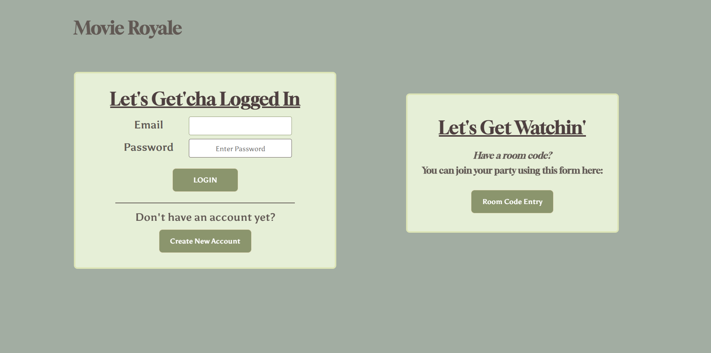
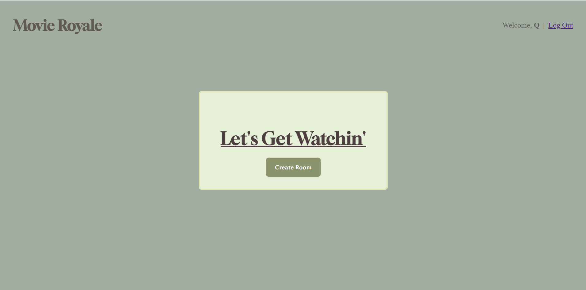

# H1 Title: Movie Royale

## H2 Screenshots:

## H2 Technologies Used: Javascript, CSS, Node, Express, Axios, BCrypt, Dotenv, Jsonwebtoken, Mongoose, Morgan, React, React-Router-dom, Serve-favicon, Socket.io

## H2 Getting Started: 

## H2 Link: https://movie-royale-client.onrender.com

## H2 Trello Board:[Trello Board Link](https://trello.com/invite/b/F2WGz11j/ATTI5aaa1329be6e31e117da8fcd4790ce10521DA513/project-3)

## H2 Pitch-Deck:[Pitch-Deck Link](https://docs.google.com/presentation/d/1vz4rSrZ6WwQ5EcNfqbUZa2ejNJkHaDG_g8KENmhAnu8/edit?usp=sharing)

## H2 Next Steps:

## H2	Version 2:  
			1. As a user, I want to receive a notification when new movies are recommended.
			2. As a user, I want to be able to customize the room name.
			3. As a user, I want to be able to customize the rating (pg/pg-13/etc) visible in the room’s browser.
			4. As a user, I want to be able to set a timer for movie voting.
			5. As a user, I want to be able to filter movies by genre.
			6. As a user, I want to be able to freeze voting/suggesting in the room.

## H2	Version 3:  
			1. As a user with an account, I want to be able to see all the rooms I have participated in (even if they were made by other users).
			2. As a user without an account, I want to be able to enter a room code from another user.
			3. As a user, I want to be able to share the room code with my friends (via a share button that sends texts/emails for me).
			4. As a user, I want to be able to post a trailer link when I suggest a movie.
			5. As a user, I want to be able to get the description/synopsis of a movie that has been recommended.

