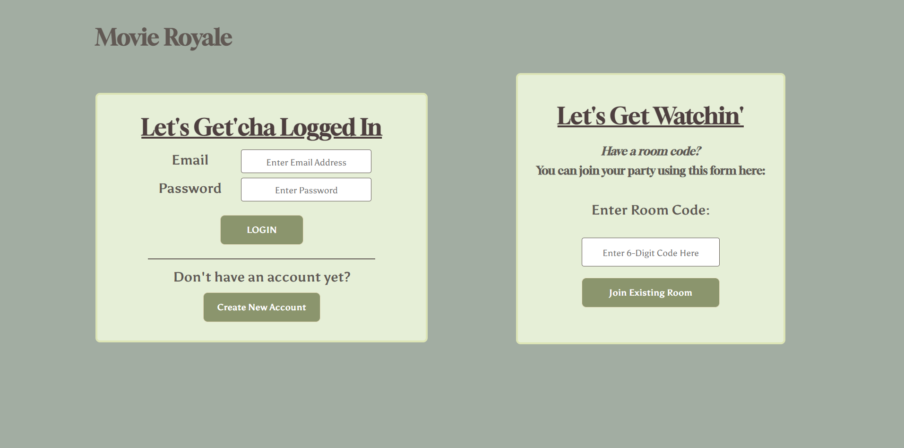
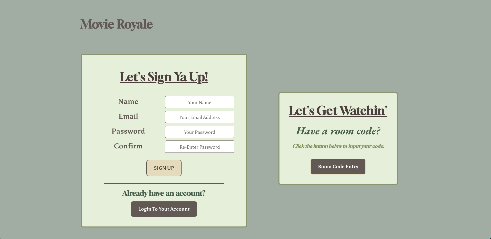
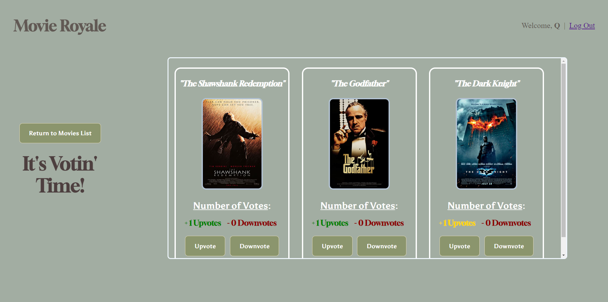

# Title: Movie Royale

Movie Royale eliminates the constant squalling and headaches that come from a movie night. Rather than scrolling through Netflix or another stream service, get ahead of the game by using Movie royale to quickly and effectively recommend and vote on your favorite movie! After creating an account, simply send the room code to your friends. Once in the room, everyone will be able to persue, recommend, and vote on what to watch as a group. This app can be accessed by anyone with wifi and a computer or mobile device, so you can figure out your watch party plans before the pizza gets cold.

## Screenshots:

---

### Technologies Used:

- Javascript
- CSS
- Node
- Express
- Axios
- BCrypt
- Dotenv
- Jsonwebtoken
- Mongoose
- Morgan
- React
- React-Router-dom
- Serve-favicon
- Socket.io

---

## Getting Started:

[Link to project](https://movie-royale-client.onrender.com)

[Trello Board](https://trello.com/invite/b/F2WGz11j/ATTI5aaa1329be6e31e117da8fcd4790ce10521DA513/project-3)

[Pitch-Deck](https://docs.google.com/presentation/d/1vz4rSrZ6WwQ5EcNfqbUZa2ejNJkHaDG_g8KENmhAnu8/edit?usp=sharing)

---

### Next Steps:

#### Version 2:

    1. As a user, I want to receive a notification when new movies are recommended.
    2. As a user, I want to be able to customize the room name.
    3. As a user, I want to be able to customize the rating (pg/pg-13/etc) visible in the room’s browser.
    4. As a user, I want to be able to set a timer for movie voting.
    5. As a user, I want to be able to filter movies by genre.
    6. As a user, I want to be able to freeze voting/suggesting in the room.

#### Version 3:

    1. As a user with an account, I want to be able to see all the rooms I have participated in (even if they were made by other users).
    2. As a user without an account, I want to be able to enter a room code from another user.
    3. As a user, I want to be able to share the room code with my friends (via a share button that sends texts/emails for me).
    4. As a user, I want to be able to post a trailer link when I suggest a movie.
    5. As a user, I want to be able to get the description/synopsis of a movie that has been recommended.

#

## <a href="https://movie-royale-client.onrender.com/">Click to Demo</a>

| The Team        | Development Role |                                                                               LinkedIn                                                                                |                                                                      Github                                                                      |
| :-------------- | :--------------: | :-------------------------------------------------------------------------------------------------------------------------------------------------------------------: | :----------------------------------------------------------------------------------------------------------------------------------------------: |
| Eddie Hernandez |    Full-Stack    |                              |  |
| Paul Seabrook   |    Full-Stack    |  |        |
| Scott Ankiewicz |     Back-End     |         |               |
| Quentin Lee     |     Back-End     |                |               |

## :pencil: Description

<b>Movie Royale</b> eliminates the constant squalling and headaches that come from a movie night. Rather than scrolling through Netflix or another stream service, get ahead of the game by using Movie royale to quickly and effectively recommend and vote on your favorite movie! After creating an account, simply send the room code to your friends. Once in the room, everyone will be able to persue, recommend, and vote on what to watch as a group. This app can be accessed by anyone with wifi and a computer or mobile device, so you can figure out your watch party plans before the pizza gets cold.

 

  
  ## :camera_flash: Screenshots
  
  

Sign In / Room Code Entry
</img></img>

  

Sign Up / Room Code Entry
</img>

  

Room Creation
</img>

  

Movie Selection Page
</img>

  

Voting Room Page
</img>

## :computer: Technologies Used

## :movie_camera: How To Use

🎞 Let's Get Votin'! 🎬

1. `Create An Account` by using the Create An Account button in the bottom of the page.
2. Fill out the form and once completed click the `Sign Up` button to login.
3. Upon login, you will find yourself at the 'Create Room' page, where you will create a new voting room & be granted a unique room code.
4. Share the unique room code with your friends, family, and otherfellow movie watchers in order to collaborate and vote from a selected list of movies.
5. `Recommend` a specific movie by clicking the recommend button underneath each movie (there are no limits as to how many movies you wish to recommend).
6. Once you're done accepting recommendations, head into the 'Voting Room' page, where you can either `Downvote` or `Upvote` a movie rec.
7. Watch carefully as Socket.IO updates users' movie upvote/downvote choices in real-time!
8. The movie with the most recommendations will be shown in the color gold.
9. Get watchin'!

## :world_map: Design

    
Trello Board 

  <a href="https://trello.com/b/F2WGz11j/movie-royale"
    > Movie Royale Trello Board</a>

  
 Deployed Link (Heroku) 

  <a href="https://movie-royale-client.onrender.com/"
    > Movie Royale Website</a>

## :rotating_light: Planned Features

### Version 2

[:x:] Add notifications when new movies are recommended 
[:x:] Enable room name customizations 
[:x:] Add the ability to filter movies by ratings (PG/PG-13/etc) & genre 
[:x:] Allow room owners to freeze voting in their room 
[:x:] Add a timer feature that sets a time limit for movie voting 

### Version 3

[:x:] Allow users with an account to view their room history, including all the rooms a user has participated in (even if they were made by other users) 
[:x:] Add the ability to share a room code button that sends a text/email on a user's behalf 
[:x:] Allow users to add trailer links to recommended movies 
[:x:] Add movie descriptions/synopses for recommended choices 